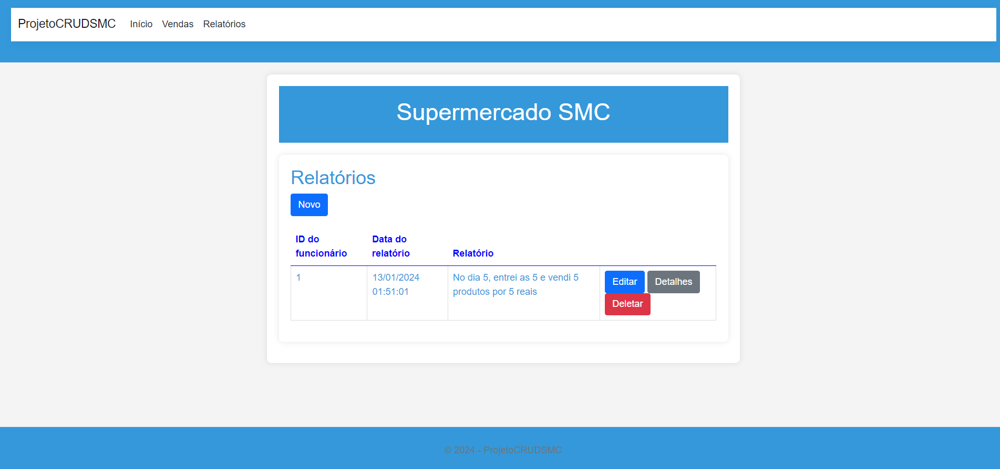
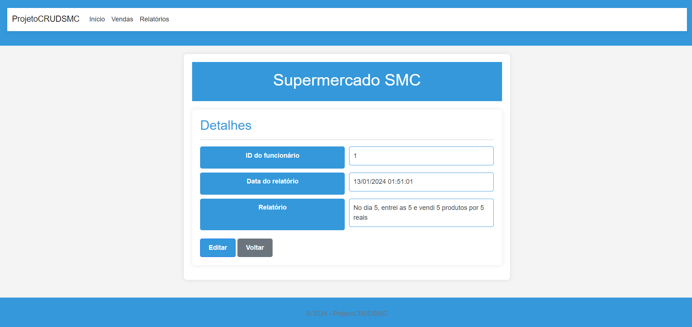

<h1 align="center">
    Projeto CRUD - Gerenciando Supermercado com C# e SQLServer🚢
</h1>
 

<h1 align="center">
    
</h1>

<h1 align="center">
    
</h1>

<h1 align="center">
    
</h1>

<h1 align="center">
    
</h1>

<h1 align="center">
    
</h1>

## 🚀Sobre o Projeto:

💻**Projeto de Um Programador**: Este é o meu projeto CRUD para gerenciar vendas e relatórios realizados por funcionários de supermercados.

## 🧑‍💻Linguagens e Tecnologias Utilizadas:

📚 **C#**: A linguagem central deste projeto.

💽 **SQL Server**: O banco de dados que armazena os dados.

📚 **ASP.NET MVC**: O suporte princial deste projeto.

🏗️ **Entity Framework**: Para interagir com o banco de dados.

🎨 **Bootstrap 5**: Para dar uma aparência mais profissional à interface.

## 🔧Como Utilizar:

🛠️ **Clonar e Rodar:** Basta clonar o repositório, usando <code>git clone</code>, configurar seu ambiente e executar o projeto no Visual Studio Community.

📝 **Cadastro de vendas:** Registre e gerencie vendas facilmente.

📊 **Relatórios Simples:** Acompanhe com maior facilidade os principais acontecimentos ocorridos dentro do supermercado.

## Objetivo:

🎯 **Aprimoramento Constante:** Como um desenvolvedor individual, estou sempre buscando aprimorar minhas habilidades e meu projeto. Este é apenas o começo da jornada, e há muito espaço para melhorias. Se você tiver sugestões ou quiser contribuir, fique à vontade para fazer parte deste projeto em constante evolução.
Lembre-se, a jornada de um programador é repleta de aprendizado contínuo. Boa sorte com seu projeto no GitHub e continue aprimorando suas habilidades!

